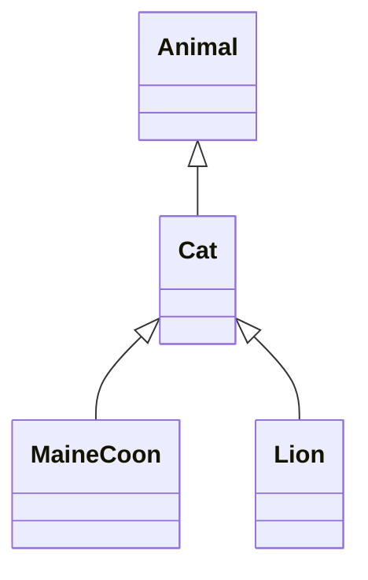

# 타입

## 내장 타입

다트 언어는 다음을 지원한다.

- 숫자 (`int`, `double`)
- 문자열 (`String`)
- 불 (`bool`)
- 레코드 (`(value1, value2)`)
- 리스트 또는 배열 (`List`)
- 셋 (`Set`)
- 맵 (`Map`)
- 룬 (`Runes`)
- 심볼 (`Symbol`)
- 널 값 (`Null`)

이 지원에는 리터럴을 사용하여 객체를 생성하는 기능이 포함된다. 예를 들어 `this is a string`은 문자열 리터럴이고 `true`는 불 리터럴이다.

일부 다른 타입도 다트 언어에서 특별한 역할을 한다.

- `Object`: `Null`을 제외한 모든 다트 클래스의 부모 클래스이다.
- `Enum`: 모든 열거형의 부모 클래스이다.
- `Future`와 `Stream`: 비동기 지원에서 사용된다.
- `Iterable`: for-in 반복문과 동기 생성기 함수에서 사용된다.
- `Never`: 표현식이 평가를 성공적으로 완료할 수 없음을 나타낸다. 항상 예외를 던지는 함수에 가장 자주 사용된다.
- `dynamic`: 정적 검사를 비활성화한다는 것을 나타낸다. 일반적으로 `Object` 또는 `Object?`를 대신 사용해야 한다.
- `void`: 값이 사용되지 않음을 나타낸다. 반환 타입으로 자주 사용된다.

### 문자열

`${표현식}`을 사용하여 문자열 내부의 표현식 값을 넣을 수 있다. 표현식이 식별자라면 `{}`을 생략할 수 있다.

```dart
var s = 'string interpolation';

assert('Dart has $s, which is very handy.' ==
    'Dart has string interpolation, '
        'which is very handy.');
assert('That deserves all caps. '
        '${s.toUpperCase()} is very handy!' ==
    'That deserves all caps. '
        'STRING INTERPOLATION is very handy!');
```

인접 문자열 리터럴 또는 `+` 연산자를 사용하여 문자열을 연결할 수 있다.

```dart
var s1 = 'String '
    'concatenation'
    " works even over line breaks.";
assert(s1 ==
    'String concatenation works even over '
        'line breaks.');

var s2 = 'The + operator ' + 'works, as well.';
assert(s2 == 'The + operator works, as well.');
```

## 레코드

레코드는 익명이고 불변인 집계 타입이다. 다른 컬렉션 타입과 마찬가지로 여러 객체를 하나의 객체로 묶을 수 있다. 다른 컬렉션 타입과 달리 레코드는 크기가 고정되어 있고, 여러 타입을 묶을 수 있으며, 타입이 지정되어 있다.

### 구문

레코드 표현식은 괄호로 묶인, 명명된 필드나 위치 필드들이 쉼표로 구분된 목록이다.

```dart
var record = ('first', a: 2, b: true, 'last');
```

레코드 타입 주석은 괄호로 묶인, 타입의 쉼표로 구분된 목록이다. 레코드 타입 주석을 사용하여 반환 타입과 매개변수 타입을 정의할 수 있다.

```dart
(int, int) swap((int, int) record) {
  var (a, b) = record;
  return (b, a);
}
```

레코드 표현식과 타입 주석의 필드는 매개변수와 인수가 함수에서 작동하는 방식을 반영한다. 위치 필드는 괄호 안에 직접 들어간다.

```dart
// 변수 선언에서의 레코드 타입 주석이다.
(String, int) record;

// 레코드 표현식으로 초기화한다.
record = ('A string', 123);
```

레코드 타입 주석에서 명명된 필드는 모든 위치 필드 다음에 중괄호로 구분된 타입과 이름 쌍의 구역 안에 들어간다. 레코드 표현식에서 이름은 각 필드 값 앞에 콜론과 함께 들어간다.

```dart
// 변수 선언에서의 레코드 타입 주석이다.
({int a, bool b}) record;

// 레코드 표현식으로 초기화한다.
record = (a: 123, b: true);
```

### 필드

레코드 필드는 내장된 획득자를 통해 접근할 수 있다. 레코드는 불변이므로 필드에는 설정자가 없다.

명명된 필드는 같은 이름의 획득자를 노출한다. 위치 필드는 명명된 필드를 건너뛰고 `$<position>`이라는 이름의 획득자를 노출한다.

```dart
var record = ('first', a: 2, b: true, 'last');

print(record.$1); // 'first'
print(record.a); // 2
print(record.b); // true
print(record.$2); // 'last'
```

레코드 필드 접근을 더욱 간단하게 만들려면 [패턴](https://dart.dev/language/patterns#destructuring-multiple-returns) 페이지를 확인한다.

### 타입

개별 레코드 타입에 대한 타입 선언은 없다. 레코드는 필드 타입에 따라 구조적으로 타입이 지정된다.

레코드의 각 필드에는 고유한 타입이 있다. 필드 타입은 동일한 레코드 내에서 다를 수 있다. 타입 시스템은 레코드에서 접근하는 모든 필드의 타입을 인식다.

```dart
(num, Object) pair = (42, 'a');

var first = pair.$1; // 정적 타입 `num`, 런타임 타입 `int`
var second = pair.$2; // 정적 타입 `Object`, 런타임 타입 `String`
```

서로 관련이 없는 두 라이브러리가 동일한 필드 집합으로 레코드를 만든다고 가정해 보겠다. 타입 시스템은 라이브러리가 서로 결합되어 있지 않더라도 두 레코드가 동일한 타입임을 이해한다.

### 동등성

```dart
(int x, int y, int z) point = (1, 2, 3);
(int r, int g, int b) color = (1, 2, 3);

print(point == color); // true
```

```dart
({int x, int y, int z}) point = (x: 1, y: 2, z: 3);
({int r, int g, int b}) color = (r: 1, g: 2, b: 3);

print(point == color); // false. Lint: Equals on unrelated types.
```

### 여러 값 반환하기

레코드를 사용하면 함수가 여러 값을 함께 묶어 반환할 수 있다.

```dart
// 여러 값을 레코드에 담아 반환한다.
(String name, int age) userInfo(Map<String, dynamic> json) {
  return (json['name'] as String, json['age'] as int);
}

final json = <String, dynamic>{
  'name': 'Dash',
  'age': 10,
  'color': 'blue',
};

// 위치 필드로 레코드 패턴을 사용하여 구조 분해한다.
var (name, age) = userInfo(json);

/* 다음과 동일하다.
  var info = userInfo(json);
  var name = info.$1;
  var age  = info.$2;
*/
```

콜론(`:`) 구문으로 명명된 필드를 사용하여 레코드를 구조 분해할 수도 있다.

```dart
({String name, int age}) userInfo(Map<String, dynamic> json)
// ···
// 명명된 필드로 레코드 패턴을 사용하여 구조 분해한다.
final (:name, :age) = userInfo(json);
```

레코드 없이도 함수에서 여러 값을 반환할 수 있지만 다른 방법에는 단점이 있다. 예를 들어 클래스를 만들면 훨씬 더 장황해지며, `List`나 `Map`과 같은 다른 컬렉션 타입을 사용하면 타입 안전성을 잃게 된다.

## 컬렉션

다트는 리스트, 셋, 맵 컬렉션에 대한 내장 지원이 있다.

## 타입 시스템

타트의 타입 시스템은 자바 및 C#의 타입 시스템과 마찬가지로 철저하다. 정적 검사(컴파일 타임 오류)와 런타임 검사의 조합을 사용하여 이러한 철저함을 강요한다.

### 대체 타입

타입을 대체할 때, 소비자와 생산자의 관점에서 생각하면 이해가 쉽다. 소비자는 타입을 흡수하고 생산자는 타입을 생성한다.

**소비자 타입을 상위 타입으로 대체하고, 생산자 타입을 하위 타입으로 대체할 수 있다.**

#### 간단한 타입 할당

다음과 같은 타입 계층이 있다고 가정해 보겠다.



다음 할당에서는 `Cat c`가 소비자이고 `Cat()`이 생산자이다.

```dart
Cat c = Cat();
```

소비자 입장에서는 특정 타입(`Cat`)을 소비하는 무언가를 아무거나 소비하는 것(`Animal`)으로 대체해도 문제없다.

```dart
Animal c = Cat(); // 문제없다.
```

하지만 `Cat c`를 `MaineCoon c`로 바꾸면 부모 클래스가 `Lion` 같은 다른 행동을 하는 `Cat` 타입을 제공할 수 있으므로 타입 안정성이 깨진다.

```dart
MaineCoon c = Cat(); // 오류가 발생한다.
```

생산자 입장에서는 타입을 생산하는 무언가(`Cat`)를 보다 구체적인 타입(`MaineCoon`)으로 대체해도 문제없다.

```dart
Cat c = MaineCoon(); // 문제없다.
```

#### 제네릭 타입 할당

다음 예시에서 `List<MaineCoon>`은 `List<Cat>`의 하위 타입이므로, `MaineCoon` 리스트를 `myCats`에 할당할 수 있다.

```dart
// 문제없다.
List<MaineCoon> myMaineCoons = ...
List<Cat> myCats = myMaineCoons;
```

하지만 반대는 어떨까요? `Animal` 리스트를 `List<Cat>`에 할당할 수 있을까요?

```dart
// 오류가 발생한다.
List<Animal> myAnimals = ...
List<Cat> myCats = myAnimals;
```

이 할당은 `Animal`과 같은 비동적 타입에서는 허용되지 않는 암시적 다운캐스트를 생성하기 때문에 정적 분석을 통과하지 못한다.

이런 코드가 정적 분석을 통과하게 만들려면 명시적 형변환을 사용하면 된다.

```dart
List<Animal> myAnimals = ...
List<Cat> myCats = myAnimals as List<Cat>;
```

하지만 명시적 형변환은 형변환되는 리스트(`myAnimals`)의 실제 타입에 따라 런타임에 여전히 실패할 수 있다.

#### 메서드

메서드를 재정의할 때도 생산자와 소비자 규칙은 동일하게 적용된다.

```
class Animal {
  void chase(Animal a) {}
  //   ^^^^^ 소비자
  Animal get parent => ...
  //     ^^^^^^^^^^ 생산자
}
```

소비자(`chase(Animal)` 메서드)의 경우에는 매개변수 타입을 상위 타입으로 대체할 수 있다. 생산자(`parent` 획득자 메서드)의 경우에는 반환 타입을 하위 타입으로 바꿀 수 있다.
